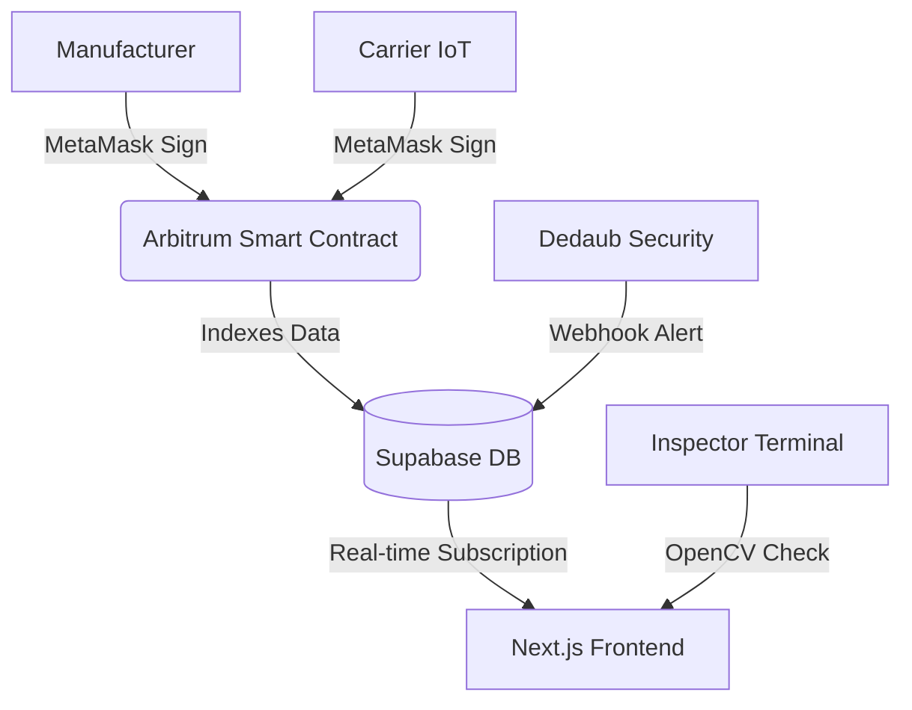

<div align="center">
  
  
  # PharmaTrace
  **Enterprise-Grade Decentralized Pharmaceutical Supply Chain Ledger**

  [](https://nextjs.org/)
  [](https://arbitrum.io/)
  [](https://www.typescriptlang.org/)
  [](https://tailwindcss.com/)
  [](https://supabase.com/)
  [](https://opencv.org/)
</div>

<br />

## 🚀 Overview

**PharmaTrace** is a highly secure, full-stack Web3 application designed to solve a critical real-world problem: pharmaceutical counterfeiting and cold-chain supply failures. 

By bridging the gap between **Web3 Smart Contracts**, **IoT Telemetry**, **Computer Vision**, and a robust **Next.js** frontend, PharmaTrace ensures that vital medicine reaches patients safely, securely, and transparently. This project demonstrates an ability to architect complex, scalable, and secure systems that integrate emerging technologies into a seamless user experience.

---

## 💼 Business Value & Impact

- **Zero-Trust Transparency:** Utilizes Immutable Provenance on the Arbitrum L2 blockchain. Every supply chain handover requires cryptographic signatures, making fraud impossible.
- **Real-Time IoT Cold Chain Monitoring:** Vaccines and biologics must stay within a strict 2–8°C safe band. The system instantly detects temperature breaches and permanently spoils compromised batches on-chain.
- **Automated Regulatory Compliance:** One-click generation of beautifully formatted PDF Audit Reports (using jsPDF) containing full batch histories, telemetry logs, and cryptographic proofs for regulatory authorities.

---

## 🛠️ Tech Stack Highlights

PharmaTrace was built to demonstrate proficiency across the modern full-stack ecosystem:

### Frontend
- **Framework:** Next.js 14 (App Router) & React
- **Language:** TypeScript (Strict Typing)
- **Styling:** Tailwind CSS, Framer Motion, and Shadcn UI for a polished, responsive, and highly interactive user interface.
- **Features:** Client-side Computer Vision (OpenCV.js) for physical hologram scanning.

### Backend & Database
- **Database:** Supabase (PostgreSQL) with strict Row Level Security (RLS) policies.
- **Authentication:** Custom Role-Based Access Control (RBAC) securely handled via Supabase Triggers and Edge Functions.
- **API:** Next.js Serverless Route Handlers.

### Blockchain (Web3)
- **Smart Contracts:** Solidity (0.8.20) & OpenZeppelin AccessControl.
- **Network:** Arbitrum Sepolia L2 (Optimistic Rollup for low gas and high scalability).
- **Integration:** Ethers.js for wallet connections and contract interactions.
- **Security:** Dedaub Security Suite webhooks for real-time vulnerability and anomaly monitoring.

---

## 🌟 Key Features

1. **Dynamic Role-Based Access Control (RBAC):**
   - A highly secure role allocation system with a dedicated **Superior Head** dashboard that can instantly grant or revoke permissions (Admin, Manufacturer, Carrier, Inspector, Visitor) to any registered user.
   - Secure defaults ensure all new signups receive a restricted `VISITOR_ROLE` until explicitly authorized.

2. **Computer Vision Verification (OpenCV):**
   - The Pharmacy Inspector Terminal uses advanced Computer Vision to verify physical holographic seals and packaging integrity directly in the browser before dispensation.

3. **Live Telemetry & Spoilage Alerts:**
   - Real-time IoT data ingestion. Any cold-chain breach triggers an immediate, irreversible "SPOILED" status on the blockchain, simultaneously notifying administrators via WebSocket-powered UI alerts.

4. **Automated PDF Audit Generation:**
   - Detailed, dynamic PDF generation for regulatory compliance, displaying immutable ledger proofs, temperatures, locations, and timestamps.

5. **Consumer Transparency Portal:**
   - A dedicated public tracking route allowing end consumers to verify their product's provenance with real-time tracking data.

---

## 🏗️ Architecture Flow



---

## 🚀 Run Locally

1. Clone the repository and install dependencies:
   ```bash
   npm install
   ```
2. Configure your Environment Variables (`.env.production`):
   - `NEXT_PUBLIC_SUPABASE_URL`
   - `NEXT_PUBLIC_SUPABASE_ANON_KEY`
   - `NEXT_PUBLIC_CONTRACT_ADDRESS`
3. Run the development server:
   ```bash
   npm run dev
   ```
4. Access the application at `http://localhost:3000`.

---

<div align="center">
  <b>Built with ❤️ and a passion for engineering secure, scalable solutions.</b>
</div>
