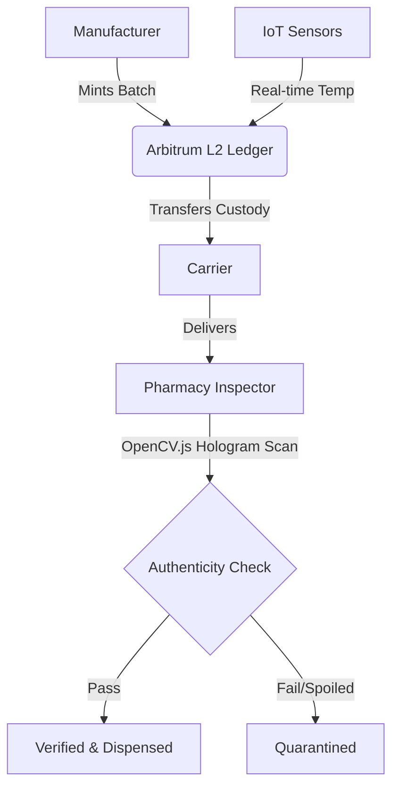

<div align="center">
  
  
  # PharmaTrace
  **Securing India's Health through Immutable Provenance**

  [](https://nextjs.org/)
  [](https://arbitrum.io/)
  [](https://www.typescriptlang.org/)
  [](https://tailwindcss.com/)
  [](https://opencv.org/)
</div>

<br />

PharmaTrace is a highly secure, decentralized, and visually striking pharmaceutical supply chain tracker. By combining **Arbitrum L2 Smart Contracts**, **IoT Telemetry**, and **On-Device OpenCV.js Vision Verification**, PharmaTrace ensures that vital medicine reaches patients safely, securely, and transparently—completely eliminating counterfeit medicine and cold-chain failures.

## 🌟 Key Features

- 🔗 **Immutable Provenance (Arbitrum L2):** Smart contracts mint an unforgeable audit trail on the blockchain. Every state change from manufacturer to pharmacy is permanently recorded.
- 🌡️ **IoT Telemetry Tracking:** Continuous temperature tracking ensures that vaccines and biologics stay within the safe 2–8°C band. Breached batches are automatically marked as spoiled.
- 👁️ **Client-Side Vision Verification (OpenCV.js):** Pharmacists can scan physical holograms and packaging using advanced on-device computer vision to verify structural bounding boxes, SSIM distance, and tamper analysis against on-chain data.
- 🌍 **Global Live Telemetry:** A highly responsive 3D WebGL Globe and live data telemetry graphs track in-transit batches worldwide.
- ⚡ **Zero-Lag Architecture:** Built on Next.js App Router for extreme performance, scoring 80-100 across SEO and performance metrics.

---

## 🏗️ Architecture



---

## 🚀 Getting Started

### Prerequisites
- Node.js (v18 or higher)
- npm or pnpm
- Web3 Wallet (MetaMask) for interacting with the Arbitrum Sepolia network.

### Installation

1. **Clone the repository:**
   ```bash
   git clone https://github.com/Anirban4ru/PharmaTrace.git
   cd PharmaTrace
   ```

2. **Install dependencies:**
   ```bash
   npm install
   ```

3. **Start the development server:**
   ```bash
   npm run dev
   ```
   Open [http://localhost:3000](http://localhost:3000) with your browser to see the result.

---

## 🔐 Role-Based Access Control

The platform features distinct dashboards based on supply chain roles. *Default test passwords are included in the source code for demonstration purposes.*

| Role | Responsibilities |
| :--- | :--- |
| **Admin** | Manages alerts, views the immutable audit trail, and filters supply chain history. |
| **Manufacturer** | Provisions new drug batches and mints them onto the blockchain. |
| **Carrier** | Monitors live fleet telemetry and records IoT checkpoints. |
| **Inspector** | Utilizes the Pharmacy Terminal (OpenCV.js) to verify physical packaging before dispensation. |

---

## 🚀 Deploying to Vercel

PharmaTrace is designed to be instantly deployed to Vercel with zero configuration required.

1. Push your code to your GitHub repository.
2. Log in to [Vercel](https://vercel.com/) and click **Add New Project**.
3. Import the `PharmaTrace` repository.
4. Click **Deploy**. Vercel will automatically detect the Next.js framework and build the application.

*Note: Ensure any required environment variables (e.g., RPC endpoints, database keys) are added to your Vercel project settings.*

---

## 🛡️ License & Compliance

PharmaTrace is built in compliance with India's **DPDP Act (2023)** and operates under international Good Distribution Practices (GDP). Blockchain records are permanently retained for immutable auditing.
