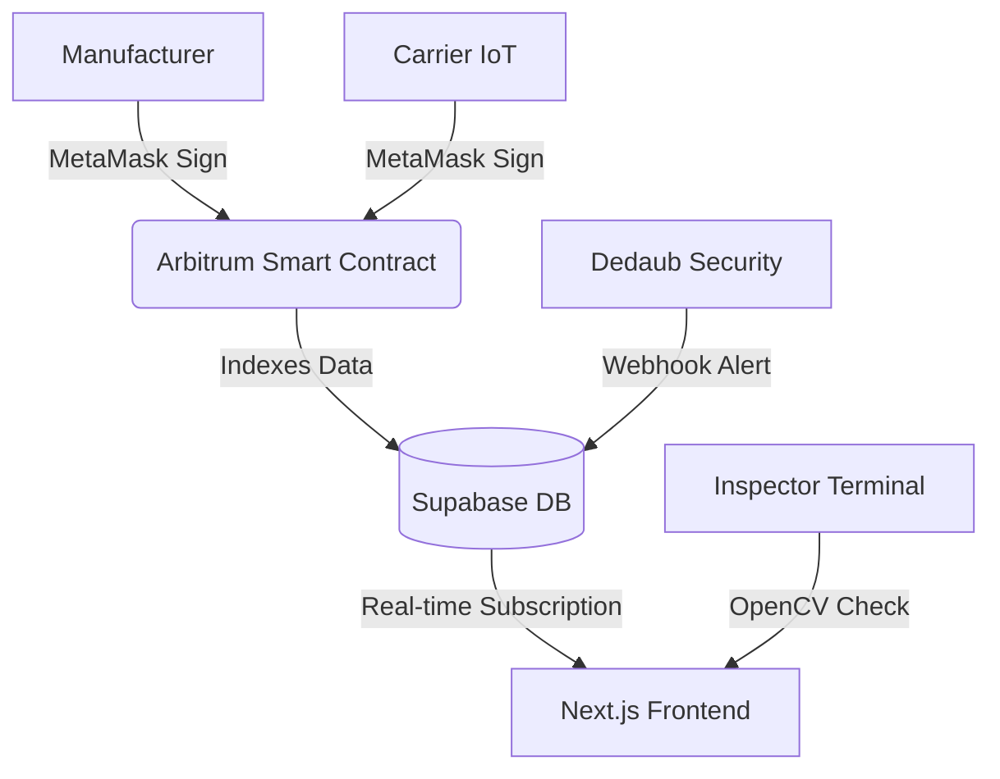

  
  
  # PharmaTrace
  **Securing India's Health through Immutable Provenance**

  
  
  
  
  
  

 

PharmaTrace is a highly secure, enterprise-grade decentralized pharmaceutical supply chain tracker. By combining **Web3 Smart Contracts**, **IoT Telemetry**, **Computer Vision**, and **Supabase Database Architecture**, PharmaTrace ensures that vital medicine reaches patients safely, securely, and transparently—completely eliminating counterfeit medicine and cold-chain failures.

## 🌟 Key Features

- 🔗 **Immutable Provenance (Web3):** Smart contracts act as an unforgeable audit trail on the Arbitrum Sepolia L2 blockchain. Every state change from manufacturer to pharmacy requires a cryptographic signature.
- 🌡️ **IoT Telemetry Tracking:** Continuous temperature tracking ensures that vaccines and biologics stay within the safe 2–8°C band. Breaches trigger immediate on-chain revocations.
- 🛡️ **Dedaub Security Integration:** Utilizes Dedaub Security Suite webhooks and Supabase Realtime to instantly trigger critical red alerts on the Admin dashboard the moment a batch is spoiled on-chain.
- 👁️ **Computer Vision Verification (OpenCV):** The Pharmacy Terminal uses client-side OpenCV.js to verify physical holographic seals and packaging integrity before dispensation.
- 🌐 **Anti-Phishing Handoff:** Strict domain verification protects the physical-to-digital handoff, ensuring the Inspector terminal is not running on a lookalike spoofed domain.
- ⚡ **Zero-Lag Architecture:** Built on Next.js App Router for extreme performance, scoring highly across SEO and performance metrics.
- 📄 **Automated Audit Reports & Web Push:** One-click generation of beautifully formatted, finalized PDF audit reports for regulatory compliance, alongside Service Worker-based Web Push Notifications for instant anomaly alerts.
- 🔍 **Consumer Tracking:** Dedicated public `/track/[batchId]` route allowing end consumers to verify product provenance with live 3D visualization and real-time viewership counts powered by Supabase Presence.
- 🎨 **Dynamic Brutalist UI:** Highly interactive interface powered by Framer Motion, Cmdk global search, and Canvas Confetti, ensuring high user engagement and flawless responsive design.
- 📦 **GS1 QR Code Integration:** Automatically generates and prints standardized GS1 QR Code shipping labels directly from the Manufacturer dashboard.

---

## 🏗️ Architecture

---

## 🚀 Deployment Guide (Vercel)

PharmaTrace requires both a Web3 Smart Contract deployment and a Web2 Frontend deployment. Follow these exact steps to launch your own instance from scratch.

### Phase 1: Smart Contract Deployment (Web3)

1. **Install MetaMask:** Ensure you have the [MetaMask browser extension](https://metamask.io/) installed and set to the **Arbitrum Sepolia** Testnet.
2. **Obtain Test ETH:** Get free Arbitrum Sepolia ETH from a faucet to pay for deployment gas fees.
3. **Open Remix IDE:** Navigate to [Remix Ethereum IDE](https://remix.ethereum.org/).
4. **Compile & Deploy:** 
   - Create a new file `MedicineTracker.sol` and paste the contents of `contracts/MedicineTracker.sol`.
   - Compile using Solidity `0.8.20`.
   - Under the Deploy dropdown, select **Injected Provider - MetaMask**.
   - Click **Deploy** and confirm the transaction in your wallet.
5. **Save the Address:** Once deployed, copy the resulting **Contract Address**.

### Phase 2: Supabase Setup (Database)

1. Create a free account at [Supabase](https://supabase.com/) and start a new project.
2. Obtain your **Project URL** and **Anon Public Key** from the Project Settings -> API page.
3. Run the SQL schema to create the `batches`, `telemetry_checkpoints`, `alerts`, `audit_logs`, and `verifications` tables.

### Phase 3: Vercel Deployment (Frontend)

1. Push this repository to your own GitHub account.
2. Log in to [Vercel](https://vercel.com/) and click **Add New Project**.
3. Import your PharmaTrace repository.
4. **CRITICAL STEP - Environment Variables:** Before clicking deploy, open the Environment Variables section in Vercel and add the following exactly:

| Variable Name | Description |
| :--- | :--- |
| `NEXT_PUBLIC_SUPABASE_URL` | Your Supabase Project URL |
| `NEXT_PUBLIC_SUPABASE_ANON_KEY` | Your Supabase Anon Key |
| `NEXT_PUBLIC_CONTRACT_ADDRESS` | **The Contract Address you copied from Remix** |
| `DEDAUB_WEBHOOK_SECRET` | A secure password (e.g. `mySuperSecret123`) for Dedaub alerts |

5. Click **Deploy**. Vercel will automatically build and launch your decentralized application!

### Phase 4: Dedaub Security Setup (Optional)
1. Go to [Dedaub Security Suite](https://app.dedaub.com/monitoring/onboarding).
2. Set up a monitor for your Contract Address.
3. Configure a Webhook action to point to `https://YOUR_VERCEL_URL.vercel.app/api/webhooks/dedaub`.
4. Provide the `DEDAUB_WEBHOOK_SECRET` as the Bearer Token in Dedaub.

---

## 🔐 Role-Based Access Control

The platform features distinct dashboards based on supply chain roles. *Default test passwords are included in the source code for demonstration purposes.*

| Role | Passcode | Responsibilities |
| :--- | :--- | :--- |
| **Admin** | `admin123` | Manages critical alerts, files official audit revocations, and exports PDF reports. |
| **Manufacturer** | `mfg123` | Provisions new drug batches and mints them onto the blockchain. |
| **Carrier** | `car123` | Monitors live fleet telemetry and records IoT checkpoints on-chain. |
| **Inspector** | `ins123` | Utilizes the Pharmacy Terminal's OpenCV scanner to verify physical packaging. |

> **Note on Web3 Usage:** Whenever you interact with the dashboards (e.g., Provisioning a batch or submitting a reading), MetaMask will pop up requiring you to sign a transaction. Ensure you have Sepolia ETH to cover gas fees!

---

## 🛡️ License & Compliance

PharmaTrace is built in compliance with India's **DPDP Act (2023)** and operates under international Good Distribution Practices (GDP). Blockchain records are permanently retained on Arbitrum for immutable auditing.
