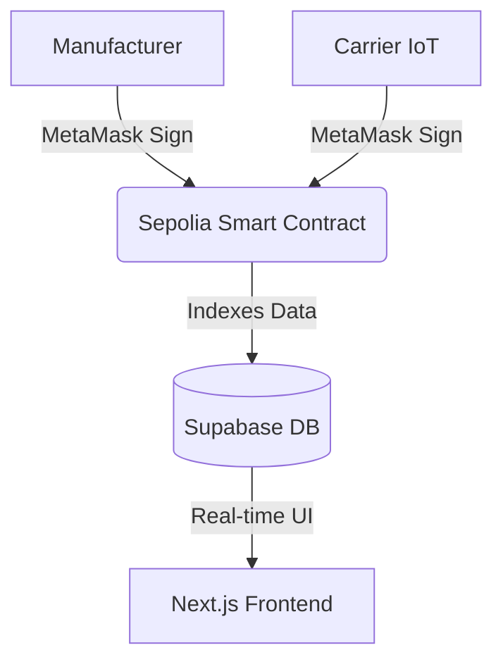

  
  
  # PharmaTrace
  **Securing India's Health through Immutable Provenance**

  
  
  
  
  

 

PharmaTrace is a highly secure, decentralized, and visually striking pharmaceutical supply chain tracker. By combining **Ethereum Smart Contracts**, **IoT Telemetry**, and **Supabase Database Architecture**, PharmaTrace ensures that vital medicine reaches patients safely, securely, and transparently—completely eliminating counterfeit medicine and cold-chain failures.

## 🌟 Key Features

- 🔗 **Immutable Provenance:** Smart contracts act as an unforgeable audit trail on the Ethereum Sepolia blockchain. Every state change from manufacturer to pharmacy requires a cryptographic signature.
- 🌡️ **IoT Telemetry Tracking:** Continuous temperature tracking ensures that vaccines and biologics stay within the safe 2–8°C band.
- 🌍 **Global Live Telemetry:** A highly responsive dashboard to track live data telemetry graphs and the status of in-transit batches worldwide.
- ⚡ **Zero-Lag Architecture:** Built on Next.js App Router for extreme performance, scoring highly across SEO and performance metrics.
- 🔐 **Web3 Integration:** Fully integrated with MetaMask and Ethers.js to sign transactions natively in the browser.

---

## 🏗️ Architecture

---

## 🚀 Deployment Guide (Highly Recommended)

PharmaTrace requires both a Web3 Smart Contract deployment and a Web2 Frontend deployment. Follow these exact steps to launch your own instance.

### Phase 1: Smart Contract Deployment (Web3)

1. **Install MetaMask:** Ensure you have the [MetaMask browser extension](https://metamask.io/) installed and set to the **Sepolia Testnet**.
2. **Obtain Test ETH:** Get free Sepolia ETH from the [Alchemy Faucet](https://sepoliafaucet.com/) to pay for deployment gas fees.
3. **Open Remix IDE:** Navigate to [Remix Ethereum IDE](https://remix.ethereum.org/).
4. **Compile the Contract:** 
   - Create a new file `MedicineTracker.sol` and paste the contents of `contracts/MedicineTracker.sol`.
   - Go to the **Solidity Compiler** tab, select version `0.8.20` (or higher), and click **Compile**.
5. **Deploy the Contract:**
   - Go to the **Deploy & Run Transactions** tab.
   - Under the Environment dropdown, select **Injected Provider - MetaMask** (or **Sepolia Testnet - MetaMask**).
   - Click **Deploy** and confirm the transaction in your MetaMask wallet.
6. **Save the Address:** Once deployed, copy the resulting **Contract Address**.

### Phase 2: Supabase Setup (Database)

1. Create a free account at [Supabase](https://supabase.com/) and start a new project.
2. Obtain your **Project URL** and **Anon Public Key** from the Project Settings -> API page.
3. Use the provided SQL editor in Supabase to set up your tables (Batches and Telemetry).

### Phase 3: Vercel Deployment (Frontend)

1. Push this repository to your own GitHub account.
2. Log in to [Vercel](https://vercel.com/) and click **Add New Project**.
3. Import your PharmaTrace repository.
4. **CRITICAL STEP - Environment Variables:** Open the Environment Variables section in Vercel and add the following exactly:

| Variable Name | Value |
| :--- | :--- |
| `NEXT_PUBLIC_SUPABASE_URL` | Your Supabase Project URL |
| `NEXT_PUBLIC_SUPABASE_ANON_KEY` | Your Supabase Anon Key |
| `NEXT_PUBLIC_CONTRACT_ADDRESS` | **The Contract Address you copied from Remix** |

5. Click **Deploy**. Vercel will automatically build and launch your decentralized application!

---

## 🔐 Role-Based Access Control

The platform features distinct dashboards based on supply chain roles. *Default test passwords are included in the source code for demonstration purposes.*

| Role | Passcode | Responsibilities |
| :--- | :--- | :--- |
| **Admin** | `admin123` | Manages alerts, views the immutable audit trail. |
| **Manufacturer** | `mfg123` | Provisions new drug batches and mints them onto the blockchain. |
| **Carrier** | `car123` | Monitors live fleet telemetry and records IoT checkpoints. |
| **Inspector** | `ins123` | Utilizes the Pharmacy Terminal to verify physical packaging before dispensation. |

> **Note on Web3 Usage:** Whenever you interact with the dashboards (e.g., Provisioning a batch or submitting a reading), MetaMask will pop up requiring you to sign a transaction. Ensure you have Sepolia ETH to cover gas fees!

---

## 🛡️ License & Compliance

PharmaTrace is built in compliance with India's **DPDP Act (2023)** and operates under international Good Distribution Practices (GDP). Blockchain records are permanently retained on Ethereum for immutable auditing.
