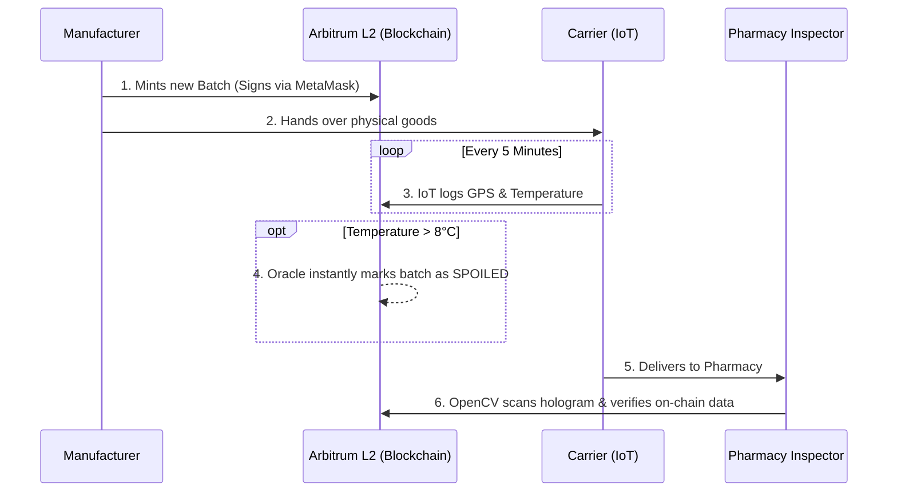

# Introduction to PharmaTrace

Welcome to the official documentation for **PharmaTrace** — an enterprise-grade, decentralized pharmaceutical supply chain ledger.

PharmaTrace was built to solve two of the most critical and life-threatening issues in the global healthcare supply chain:
1. **Counterfeit Medicine:** Up to 20% of drugs in developing markets are counterfeit.
2. **Cold-Chain Failures:** Temperature excursions (like a truck's refrigeration failing) can instantly ruin life-saving vaccines and biologics.

By combining the immutable security of **Web3 Smart Contracts**, real-time **IoT Telemetry**, and client-side **Computer Vision**, PharmaTrace ensures that vital medicine reaches patients safely, securely, and transparently.

---

## 🏗️ High-Level Architecture

PharmaTrace operates on a "Zero-Trust" model. No single entity (not even the administrator) can secretly alter the history of a drug batch once it is minted on the blockchain.

### The Technology Stack
- **Frontend / Client:** Next.js 14 (App Router), React, Tailwind CSS, Shadcn UI
- **Computer Vision:** OpenCV.js (Client-side holographic seal verification)
- **Database / Backend:** Supabase (PostgreSQL), Edge Functions, Realtime Subscriptions
- **Blockchain (Web3):** Arbitrum Sepolia L2, Solidity (0.8.20), Ethers.js
- **Security Oracle:** Dedaub Security Suite (Real-time smart contract monitoring)

### How It Works (The Lifecycle)

1. **Provisioning:** The Manufacturer provisions a new batch of medicine. They sign a Web3 transaction via MetaMask, minting the batch onto the Arbitrum L2 blockchain.
2. **Transit & Telemetry:** The Carrier takes possession. IoT sensors stream temperature and GPS data. If the temperature breaches the safe threshold (2°C - 8°C), an automated oracle permanently marks the smart contract state as `SPOILED`.
3. **Verification:** The Pharmacy Inspector receives the physical box. They use their webcam (powered by OpenCV) to scan the physical holographic seal. The system cross-references the physical scan with the immutable blockchain ledger before allowing dispensation.
4. **Auditability:** Administrators can generate instant, cryptographically-backed PDF Audit Reports for regulatory compliance.

---

## 🔐 Role-Based Access Control (RBAC)

To interact with the ledger, users are assigned strictly enforced roles via the Supabase database. These roles dictate which dashboards they can access and which Web3 transactions they are authorized to sign.

* **Superior Head (Admin):** Can allocate roles to users, file official revocations, and view all system alerts.
* **Manufacturer:** Authorized to mint new drug batches on-chain.
* **Carrier:** Authorized to log telemetry checkpoints against active batches.
* **Inspector:** Authorized to perform final endpoint verification using computer vision.
* **Visitor:** Default role. Restricted to consumer-level public tracking.
