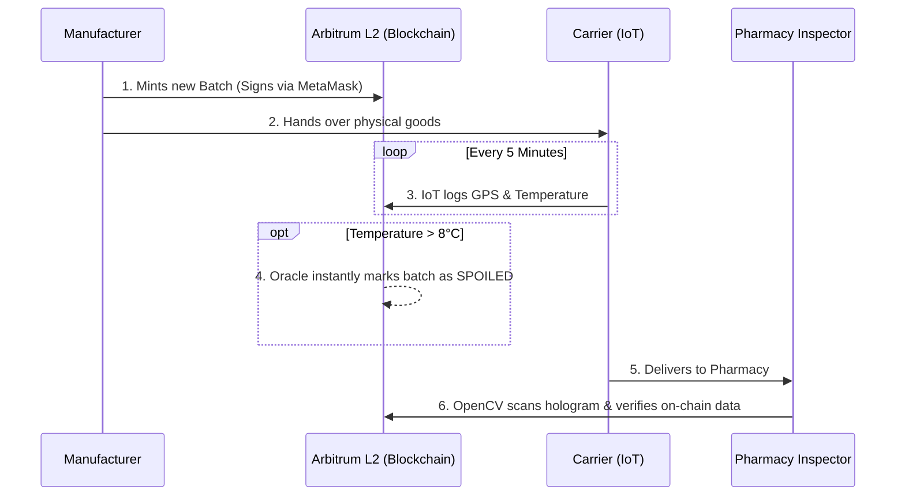

  
  <h1>PharmaTrace</h1>
  
<b>The Pharmaceutical Integrity Ledger</b>

  
<i>Securing the global supply chain with Web3, IoT, and Computer Vision.</i>

---

## 🌍 The Global Crisis

The global pharmaceutical supply chain is facing two life-threatening vulnerabilities:
1. **Counterfeit Medicine:** Up to 20% of drugs in developing markets are counterfeit, leading to tragic outcomes.
2. **Cold-Chain Failures:** Temperature excursions (e.g., a truck's refrigeration failing) can instantly render life-saving biologics and vaccines chemically inert or toxic.

**PharmaTrace** was architected from the ground up to solve these exact problems by enforcing a **Zero-Trust** physical-to-digital bridge.

---

## 🏗️ Enterprise Architecture

PharmaTrace operates on a strict state-machine architecture. No single entity (not even system administrators) can secretly alter the history of a drug batch once it is minted on the blockchain.

### 💻 The Technology Stack
* **Frontend / Client:** Next.js 14, React, Tailwind CSS, Shadcn UI
* **Computer Vision:** OpenCV.js (Client-side holographic seal verification)
* **Database / Backend:** Supabase (PostgreSQL), Edge Functions, Realtime Subscriptions
* **Blockchain (Web3):** Arbitrum Sepolia L2, Solidity (0.8.20), Ethers.js
* **Security Oracle:** Dedaub Security Suite (Real-time smart contract monitoring)

---

## 🔄 The Lifecycle (How It Works)

> 💡 **Note:** Every step of this lifecycle requires cryptographic signatures via a Web3 wallet (like MetaMask) to prove non-repudiation.

### 1. Provisioning
The Manufacturer provisions a new batch of medicine. They sign a Web3 transaction, minting the batch onto the Arbitrum L2 blockchain.

### 2. Transit & Telemetry
The Carrier takes possession. IoT sensors stream temperature and GPS data. If the temperature breaches the safe threshold (2°C - 8°C), an automated oracle permanently marks the smart contract state as `SPOILED`.

### 3. Verification
The Pharmacy Inspector receives the physical box. They use their webcam (powered by OpenCV) to scan the physical holographic seal. The system cross-references the physical scan with the immutable blockchain ledger before allowing dispensation.

### 4. Auditability
Administrators can generate instant, cryptographically-backed PDF Audit Reports for regulatory compliance.

---

## 🔐 Role-Based Access Control (RBAC)

To interact with the ledger, users are assigned strictly enforced roles. These roles dictate which dashboards they can access and which Web3 transactions they are authorized to sign.

| Role | Permissions |
| :--- | :--- |
| **Superior Head** | Allocates roles, files official revocations, and views all system alerts. |
| **Manufacturer** | Authorized to mint new drug batches on-chain. |
| **Carrier** | Authorized to log telemetry checkpoints against active batches. |
| **Inspector** | Authorized to perform final endpoint verification using computer vision. |
| **Visitor** | Restricted to consumer-level public tracking. |
